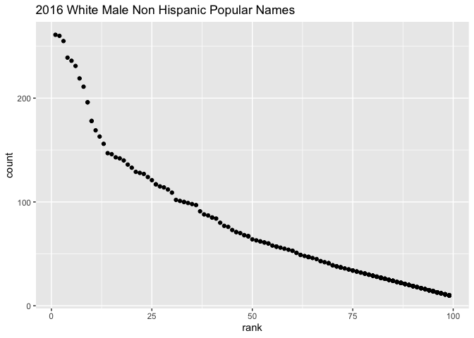

p8105\_hw2\_zv2138
================

``` r
library(tidyverse)
```

    ## ── Attaching packages ─────────────────────────────────────── tidyverse 1.3.1 ──

    ## ✓ ggplot2 3.3.5     ✓ purrr   0.3.4
    ## ✓ tibble  3.1.2     ✓ dplyr   1.0.7
    ## ✓ tidyr   1.1.3     ✓ stringr 1.4.0
    ## ✓ readr   2.0.1     ✓ forcats 0.5.1

    ## ── Conflicts ────────────────────────────────────────── tidyverse_conflicts() ──
    ## x dplyr::filter() masks stats::filter()
    ## x dplyr::lag()    masks stats::lag()

``` r
library(readxl)
```

# Problem 1

## Read and clean the Mr. Trash Wheel Sheet

``` r
trash_wheel = read_excel("./Trash-Wheel-Collection-Totals-7-2020-2.xlsx", sheet = 1, range = "A2:N535") %>% 
  janitor::clean_names() %>% 
  filter(!(str_detect(month, "Total"))) %>% 
  mutate(
    sports_balls = round(sports_balls, digits = 0),
    month = str_to_lower(month),
    month = str_replace_all(month,"decemeber", "december")
  ) 
```

## Read and Clean Precipitation data for 2018 and 2019

``` r
rain_2019 = read_excel("./Trash-Wheel-Collection-Totals-7-2020-2.xlsx", sheet = 6, range = "A2:B14") %>% 
    janitor::clean_names() %>% 
    mutate(
      year = 2019
    )
rain_2018 = read_excel("./Trash-Wheel-Collection-Totals-7-2020-2.xlsx", sheet = 7, range = "A2:B14",) %>% 
    janitor::clean_names() %>% 
    mutate(
       year = 2018
    )
```

## Combining Precipitation data sets

``` r
rain_data = bind_rows(rain_2018, rain_2019) %>% 
  mutate(
    month = str_to_lower(month.name[month])
  )
```

Mr. Trash Wheel filled 453 dumpsters from 1900-01-20 to 2021-01-04. In
total 1449.7 tons of trash was collected during this time period.
Mr. Trash Wheel collected various types of trash including
plastic\_bottles, polystyrene, cigarette\_butts, glass\_bottles,
grocery\_bags, chip\_bags, sports\_balls. In fact the median number of
sports balls that could be found in a dumpster in 2019 was 9.

Precipitation data was also collected over the years 2018 and 2019. Over
the two years a total of 104.28 inches of rain fell. In 2018 alone 70.33
inches of rain fell.

# Problem 2

## Read and Clean pols-month.csv

``` r
pols_month = read_csv("./pols-month.csv", show_col_types = F) %>% 
  janitor::clean_names() %>% 
  mutate(mon = as.character(mon)) %>% 
  separate(mon, into = c("year","month", "day"), sep = "-") %>% 
  mutate(year = as.integer(year)) %>% 
  mutate(month = as.integer(month)) %>% 
  mutate(month = str_to_lower(month.name[month])) %>% 
  mutate(prez_dem = ifelse(prez_dem == 1, "dem", "")) %>% 
  mutate(prez_gop = ifelse(prez_gop == 1, "gop", "")) %>% 
  mutate(president = paste(prez_gop,prez_dem)) %>% 
  mutate(president = str_trim(president)) %>% 
  subset(select = -c(day, prez_gop, prez_dem))
```

## Read and Clean snp.csv

``` r
snp = read_csv("./snp.csv", show_col_types = F) %>% 
  janitor::clean_names() %>% 
  mutate(date = as.character(date)) %>% 
  separate(date, into = c("month", "day", "year"), sep = "/") %>% 
  mutate(year = as.integer(year)) %>% 
  mutate(year = (ifelse(year <= 15, year + 2000, year + 1900))) %>% 
  mutate(month = as.integer(month)) %>%
  mutate(month = str_to_lower(month.name[month])) %>% 
  subset(select = -(day)) %>% 
  relocate(year, month)
```

## Read and Clean unemployment.csv

``` r
unemployment = read_csv("./unemployment.csv", show_col_types = F) %>% 
  janitor::clean_names() %>% 
  pivot_longer(
    jan:dec,
    names_to = "month", 
    values_to = "percent_unemployed"
  ) %>% 
  mutate(month = match(month, tolower(month.abb))) %>% 
  mutate(month = str_to_lower(month.name[month]))
```

## Merge unemployment, snp, and pols\_month

``` r
joined_df = left_join(pols_month, snp, by = c("year", "month"))
joined_df = left_join(joined_df, unemployment, by = c("year", "month"))   
```

Pols\_month data file contains data on the number of national
politicians (governors, senators, and presidents) who are democratic or
republican at any given time. Pols\_month has data on 822 politicians.
Data was collected from 1947 to 2015.

Snp data file contains data on the closing values of the Standard and
Poor’s stock market index for a given date. Snp has data from 787 index
observations. Data was collected from 1950 to 2015.

Unemployment data file contains data on the the percentage of
unemployment on given year and month. The file contains 816 data
entries. Data was collected from 1948 to 2015.

The three data files were merged together to create the data set
joined\_df. This file contains 822 observations. Data was collected from
1947 to 2015.

# Problem 3

## Load and tidy the data - Popular Baby Names

``` r
baby_names = read_csv("./Popular_Baby_Names.csv", show_col_types = F) %>% 
  janitor::clean_names() %>% 
  unique() %>% 
  mutate(ethnicity = str_replace_all(ethnicity,"ASIAN AND PACI$", "ASIAN AND PACIFIC ISLANDER")) %>% 
  mutate(ethnicity = str_replace_all(ethnicity,"BLACK NON HISP$", "BLACK NON HISPANIC")) %>% 
  mutate(ethnicity = str_replace_all(ethnicity,"WHITE NON HISP$", "WHITE NON HISPANIC"))
```

## Creating Olivia Table

``` r
olivia = filter(baby_names, childs_first_name == "Olivia", gender == "FEMALE")
olivia = subset(olivia, select = c(ethnicity, year_of_birth, rank))
olivia = pivot_wider(olivia, ethnicity, names_from = "year_of_birth", values_from = "rank")
knitr::kable(olivia)
```

| ethnicity                  | 2016 | 2015 | 2014 | 2013 |
|:---------------------------|-----:|-----:|-----:|-----:|
| ASIAN AND PACIFIC ISLANDER |    1 |    1 |    1 |    3 |
| BLACK NON HISPANIC         |    8 |    4 |    8 |    6 |
| HISPANIC                   |   13 |   16 |   16 |   22 |
| WHITE NON HISPANIC         |    1 |    1 |    1 |    1 |

## Creating Plot

``` r
male_wnh_2016_plot = ggplot(filter(baby_names, gender == "MALE", ethnicity == "WHITE NON HISPANIC", year_of_birth == 2016),
       aes(x = rank, y = count )) + geom_point() + ggtitle("2016 White Male Non Hispanic Popular Names")

male_wnh_2016_plot
```

<!-- -->

``` r
#ggsave(Nmaes_plot.pdf, male_wnh_2016_plot, width = 8, height = 5)
```
